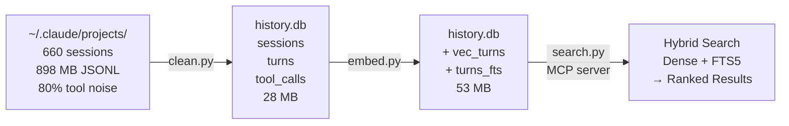
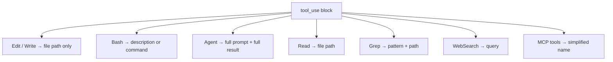
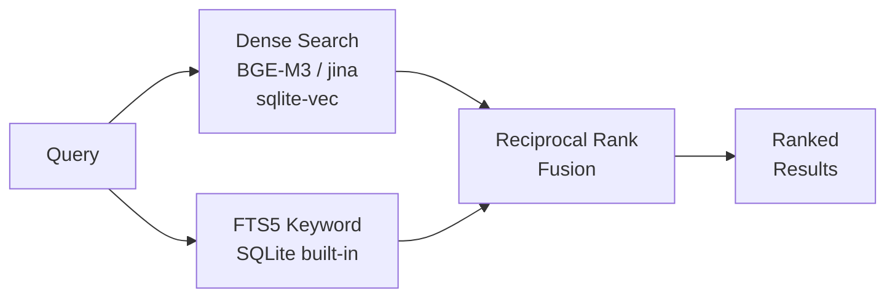
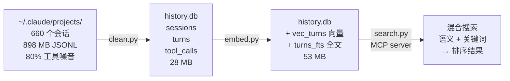
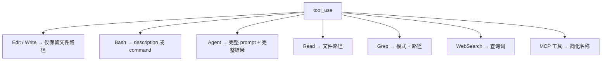
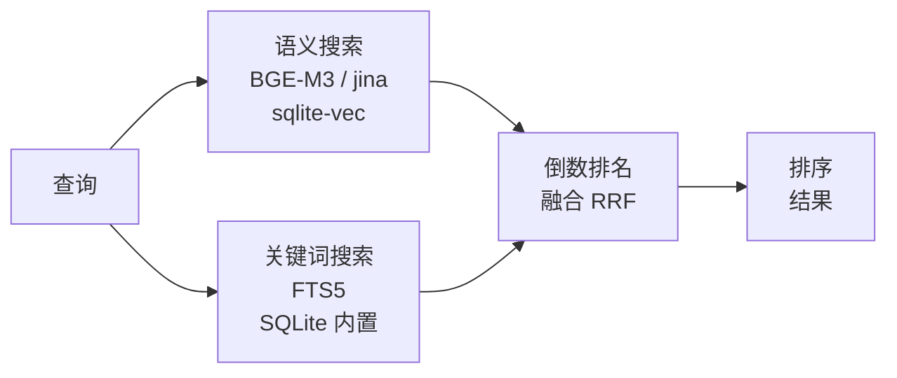

# claude-history

[English](#english) | [中文](#中文)

---

## English

**Your Claude Code conversations are a gold mine. Stop losing them.**

Claude Code generates thousands of conversation turns across hundreds of sessions — architecture decisions, debugging breakthroughs, product brainstorms, code reviews. All stored as bloated JSONL files where 80% is tool output noise.

claude-history distills 900MB of raw logs into a 28MB searchable database, then lets you find any past discussion in seconds.

```
"cross-disciplinary thinking"  →  20 results across 8 sessions, 4 projects, 3 weeks
"Electron security"            →  your security comparison, the Apifox analysis, Linux user discussion
"how we solved the auth bug"   →  the exact session where you debugged JWT refresh logic
```

### Quick Start

**As a Claude Code plugin (recommended):**

```bash
/install-plugin <repo-url>
# Done. Restart Claude Code.
```

**Manual setup:**

```bash
git clone <repo-url> && cd claude-history
uv run python setup.py    # Auto-detects GPU, installs deps, builds index, configures MCP
```

### How It Works



#### Cleaning

| Keep | Strip |
|------|-------|
| Your messages | Tool output (Bash stdout, file reads, grep results) |
| Claude's responses | System messages, progress, attachments |
| Thinking/reasoning blocks | Permission modes, queue operations |
| Tool names + smart summaries | Raw tool input (code in Edit/Write) |
| Agent prompts + results | Agent internal conversations |

Tool summaries are extracted per-tool type:



#### Embedding

| | Model | Dim | Speed | Total (5,445 turns) |
|--|-------|-----|-------|---------------------|
| GPU | BGE-M3 FP16 | 1024 | 67 turns/s | **78s** |
| CPU | jina-v2-base-zh | 768 | 68 turns/s | **80s** |

Auto-detects GPU. Falls back to CPU model seamlessly.

#### Hybrid Search



Semantic search finds related concepts ("authentication issues" → "JWT token refresh"). Keyword search catches exact terms ("Docker" → all Docker mentions). Hybrid combines both for best retrieval quality.

### Usage

#### CLI

```bash
# Search
uv run python search.py search "React Router" -n 20
uv run python search.py search "auth bug" --mode fts          # keyword only, instant
uv run python search.py search "deployment" --project myapp   # filter by project

# Browse
uv run python search.py list
uv run python search.py read 8afa30f8
uv run python search.py read 8afa30f8 --offset 15 -n 10      # paginate

# Update (incremental)
uv run python clean.py --incremental && uv run python embed.py
```

#### MCP Tools

| Tool | Description |
|------|-------------|
| `search(query, mode, limit, project)` | Hybrid/semantic/keyword search |
| `read(session, offset, limit)` | Read turns from a session |
| `list_sessions(project, limit)` | Browse sessions |

Auto-indexes on every session start — no manual maintenance.

### Installation

|  | pip packages | Model download | Total |
|--|--|--|--|
| CPU | ~750 MB | ~640 MB | **~1.4 GB** |
| GPU | ~2.7 GB | ~1.1 GB | **~3.8 GB** |

Requires: Python 3.12+, [uv](https://docs.astral.sh/uv/). GPU mode needs NVIDIA GPU with CUDA 12.x driver.

### Database

Single portable `history.db`:

```sql
sessions   (session_id, project, start_time, end_time, version, git_branch)
turns      (id, session_id, turn_index, timestamp, user_text, assistant_text, thinking)
tool_calls (id, turn_id, tool_name, summary, agent_prompt, agent_result, is_error)
vec_turns  -- sqlite-vec dense vectors
turns_fts  -- FTS5 full-text index
```

### Why Not episodic-memory?

| | episodic-memory | claude-history |
|--|--|--|
| Embedding model | all-MiniLM-L6-v2 (2019, English only) | BGE-M3 (2024, 100+ languages) |
| Context window | 512 tokens, truncated to 2000 chars | 8192 tokens |
| Chinese support | None | Native (BGE-M3 + jina-v2-base-zh) |
| GPU support | None (CPU ONNX only) | FP16 Tensor Core |
| Search quality | Broken (L2 treated as cosine) | Hybrid RRF (dense + FTS5) |
| Stability | 81 issues, 14GB mem leak, 158GB disk fill | Single-file Python, WAL mode |
| Dependencies | 501 MB node_modules | ~750 MB pip (CPU) |

See the [full analysis](docs/plans/2026-04-16-claude-history-cleaner.md).

---

## 中文

**你的 Claude Code 对话是一座金矿，别再让它们沉睡了。**

Claude Code 在数百个会话中产生了成千上万轮对话——架构决策、调试突破、产品脑暴、代码审查。全部以臃肿的 JSONL 文件存储，其中 80% 是工具输出噪音。

claude-history 将 900MB 原始日志提炼为 28MB 可搜索数据库，几秒钟找到任何历史讨论。

```
"跨学科 思维"      →  8 个会话、4 个项目、跨 3 周的 20 条结果
"Electron 安全"    →  你的安全对比、Apifox 分析、Linux 用户讨论
"上次怎么解决的"    →  精确定位到调试 JWT 刷新逻辑的那次对话
```

### 快速开始

**作为 Claude Code 插件安装（推荐）：**

```bash
/install-plugin <repo-url>
# 完成。重启 Claude Code 即可。
```

**手动安装：**

```bash
git clone <repo-url> && cd claude-history
uv run python setup.py    # 自动检测 GPU、安装依赖、构建索引、配置 MCP
```

### 工作原理



#### 清洗策略

| 保留 | 剥离 |
|------|------|
| 你的消息 | 工具输出（Bash stdout、文件内容、搜索结果）|
| Claude 的回复 | 系统消息、进度、附件 |
| 推理/思考过程 | 权限模式、队列操作 |
| 工具名 + 智能摘要 | 原始工具输入（Edit/Write 中的代码）|
| Agent prompt + 返回结果 | Agent 内部对话 |

按工具类型提取摘要：



#### 嵌入模型

| | 模型 | 维度 | 速度 | 5,445 轮总时间 |
|--|------|------|------|---------------|
| GPU | BGE-M3 FP16 | 1024 | 67 轮/秒 | **78 秒** |
| CPU | jina-v2-base-zh | 768 | 68 轮/秒 | **80 秒** |

自动检测 GPU，无 GPU 时无缝回退到 CPU 模型。

#### 混合搜索



语义搜索找到相关概念（"认证问题" → "JWT token 刷新"）。关键词搜索捕获精确匹配（"Docker" → 所有提到 Docker 的地方）。混合模式结合两者，检索质量最佳。

### 使用方法

#### 命令行

```bash
# 搜索
uv run python search.py search "跨学科 思维" -n 20
uv run python search.py search "React Router" --mode fts          # 纯关键词，秒出
uv run python search.py search "部署方案" --project paper-qa-ui   # 按项目过滤

# 浏览
uv run python search.py list
uv run python search.py read 8afa30f8
uv run python search.py read 8afa30f8 --offset 15 -n 10          # 翻页

# 增量更新
uv run python clean.py --incremental && uv run python embed.py
```

#### MCP 工具（Claude 自动调用）

| 工具 | 说明 |
|------|------|
| `search(query, mode, limit, project)` | 混合/语义/关键词搜索 |
| `read(session, offset, limit)` | 读取某个会话的对话轮次 |
| `list_sessions(project, limit)` | 浏览会话列表 |

每次启动自动增量索引，无需手动维护。

### 安装细节

|  | pip 依赖 | 模型下载 | 合计 |
|--|---------|---------|------|
| CPU | ~750 MB | ~640 MB | **~1.4 GB** |
| GPU | ~2.7 GB | ~1.1 GB | **~3.8 GB** |

需要：Python 3.12+、[uv](https://docs.astral.sh/uv/)。GPU 模式需要 NVIDIA GPU + CUDA 12.x 驱动。

### 数据库

单文件 `history.db`，可移植、可备份、任何 SQLite 客户端可查：

```sql
sessions   (session_id, project, start_time, end_time, version, git_branch)
turns      (id, session_id, turn_index, timestamp, user_text, assistant_text, thinking)
tool_calls (id, turn_id, tool_name, summary, agent_prompt, agent_result, is_error)
vec_turns  -- sqlite-vec 密集向量
turns_fts  -- FTS5 全文索引
```

### 为什么不用 episodic-memory？

| | episodic-memory | claude-history |
|--|--|--|
| 嵌入模型 | all-MiniLM-L6-v2（2019，仅英文）| BGE-M3（2024，100+ 语言）|
| 上下文窗口 | 512 tokens，截断到 2000 字符 | 8192 tokens |
| 中文支持 | 无 | 原生（BGE-M3 + jina-v2-base-zh）|
| GPU 支持 | 无（仅 CPU ONNX）| FP16 Tensor Core |
| 搜索质量 | 有 bug（L2 当 cosine 用）| 混合 RRF（语义 + 关键词）|
| 稳定性 | 81 个 issue，14GB 内存泄漏，158GB 磁盘填满 | 单文件 Python，WAL 模式 |
| 依赖体积 | 501 MB node_modules | ~750 MB pip（CPU）|

详见[完整调研分析](docs/plans/2026-04-16-claude-history-cleaner.md)。
